# `<textarea distributed>`

21 November 2016

*(This is a transcript of a talk I gave at Nodevember 2016—[here's
the video](http://youtu.be/vCkSLX7nR9Y)—and previously
at [NashFP](http://nashfp.org/) and a few other local user groups.
Thanks to [Max Beizer](https://twitter.com/maxbeizer) for Heroku help!)*

Last year at Nodevember,
[I gave a talk about tic tac toe](https://github.com/jorendorff/game-playing/blob/master/talk.md)
([video](https://www.youtube.com/watch?v=j8qC9VXGcmA)).


But really it was about the shape of time.


I said at the start of that talk,
you know, the shape of time can get really weird,
especially if you're into special relativity
or distributed systems.


"But don't worry," I said.
"We won't be talking about any of the really weird stuff today."

*(slide: me in front of light cones saying "haha j/k")*

Well.

*(slide: "one year later")*

Today's the day.

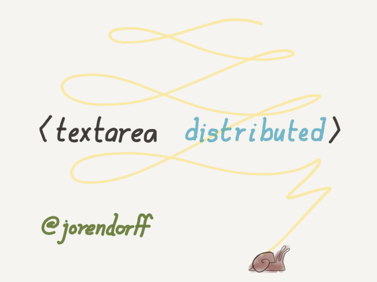


## Intro

My name is Jason,
and the story I want to tell you today starts with this box.


I decided to write a *shared textarea* in JavaScript.
You know what a `textarea` is, right?
It's just a box in a Web page, and you can type in it.
Except I wanted your work to be shared over the Internet.
So I can see what you're typing, as you type it,
and you can see what I'm typing,
and not just two people but dozens of people around the world can use it at once.

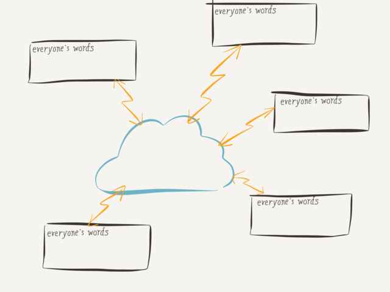

And that's what I want to show you today.


## Act I: False starts

So, I'd like you all to open your laptops and visit this URL—

*(slide: "Drive Friendly - The Texas Way")*

Oh, right.
I do want to take a moment before we begin
to ask you to participate in the spirit of the thing.
I realize that when you're sharing a textarea with other people,
you *can* just hold down the delete key,
and then no one else really gets to use it.
Uh, or you could paste War and Peace into it,
so that everybody gets their own copy of War and Peace,
completely melting the conference wi-fi.
We get it; you're very clever.
Please don't do that.
The point is for everyone to have a chance to try it out.


### Stab 1: Clobberation

So having said that, let's give the app a shot.
Now this is my first attempt at writing a collaborative text editor,
and it may not be entirely perfect.
But go ahead and connect to this URL and try it out.

*(If you've got Node, [run this server](https://github.com/jorendorff/clobberation)
and ask some friends to connect! It's super easy!)*

*(clobberation is awful)*

OK, maybe that's enough of that.

So how was that?

*(confused murmur)*

So that wasn't great? It was actually terrible? Hmm.
Do you think I can blame it on the wifi? No?

Well, [here's the complete source code
of the server you just connected to](https://github.com/jorendorff/clobberation/blob/master/index.js)
(27 lines of code).
This talk is all about this program
and *why it breaks down.*
I'm not going to go line by line through all this, but
let's look at a few lines in particular.

```javascript
var text = "";
```

This is the full state of our shared text editor.
Just a global string variable on the server.
After all, a text file is just a string.
That's why we'll be talking about strings a lot, later on.

```javascript
io.on('connection', function (socket) {
```

And here's the main part of the app.

```javascript
socket.on('update', function (msg) {
  text = msg;
  socket.broadcast.emit('update', msg);
});
```

So let me tell you how this works.
I'm using a library called socket.io to handle networking between the browser and the server,
because this talk isn't about networking.
I let socket.io deliver the data.

I just wrote the simplest thing I could think of.
The server has the full text of the document we're editing
in a global variable, `text`.

Whenever you type anything,
your browser sends the full text of your textbox back to the server.
The whole thing.
The server receives that update from you,
and this little update function runs.
It replaces whatever was in `text` with the new text that you sent it,
and then broadcasts that update to all other users.

This is very simple.

But there's a problem, right? What's the problem?

*(everyone talks at once)*

I'm sorry, you're all talking at once. What's the problem again?

OK, maybe there are multiple problems here.
The big one is what happens if multiple people are editing at the same time.
Let's step through it.


Suppose I type "j", because I'm typing my name,
and *at the same time*, you type "B", because you want to type "Batman".
My browser sends an update to the server.
Your browser sends an update to the server.

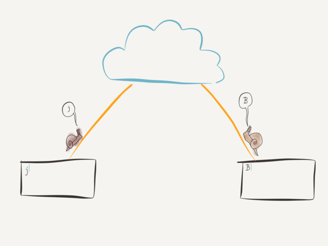

Let's say mine gets there first.
So the server says, OK, the document now says "j".
And it broadcasts an update that says "j".

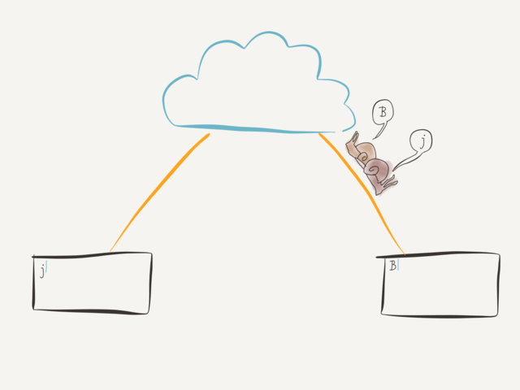

Then *your* update arrives at the server.
So the server says, OK, the document now says "B".
And it notifies *me* of the change.

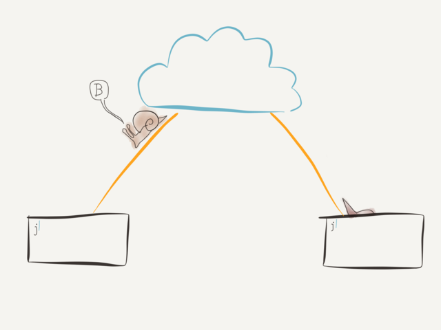

At the end of this,

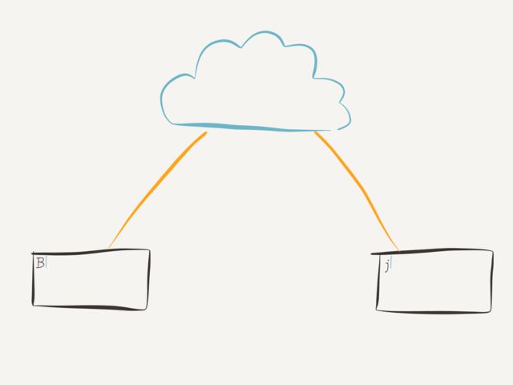

my screen says "B",
and your screen says "j".
The server thinks the document says "B".
My work got clobbered.

But it's not over!

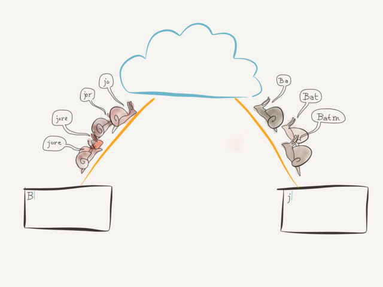

More updates are already on the way to the server,
because we've both been typing.
You can see this is never going to work.
When we're done it's going to say "Batmorendorff"...
which has a certain ring to it...
but some of the letters you typed got clobbered by my updates,
and vice versa.

So that's why I called this app "Clobberation".
It's trying to be "collaboration",
but instead it clobbers your work.


### Stab 2: Quilljoy

At this point,
a friend of mine informed me that there's an open-source text editor,
written in JavaScript,
that you can put in any Web page,
that's designed for exactly what I'm trying to do!
Sounds almost too good to be true, right?
It's called [Quill](http://quilljs.com/).

With Quill, when you type, it generates what's called a
[*delta*](http://quilljs.com/docs/deltas/),
which is really a patch.

So I hooked this up and we can try it out.
Visit this URL
and let's take a minute with Quill.

*(This server is [also super easy to grab and run](https://github.com/jorendorff/quilljoy).
It may fail to go horribly wrong for you!
I've given this talk a few times and it usually ends in tears as desired, but not always.
Quilljoy has severe problems when latency is high
or lots of users are typing at the same time; read on for details.)*

OK.

The server-side code for this, incidentally, is extremely similar to Clobberation.
It's 28 lines of Node.
Really the main difference is on the client.
Instead of using a `<textarea>`, I'm using the Quill editor,
which is just some JavaScript I didn't have to write myself.
When you hit a key, Quill generates a delta,
and all my code does is send that delta to the server,
and the server just broadcasts it to all other users.
And that's all I had to do.
The code for this is actually extremely similar to Clobberation.

This seems to work a lot better than Clobberation.
I didn't have my any of my work just *vanish*.
But take a look at the screen.
Is this the same text you've got on your screen?

*(some people say no, most likely)*

No. Quill gets confused.
Our editors get out of sync.
Can anyone tell me why?

*(nobody says anything)*

I'm sure somebody has some guesses.
Shout 'em out. It's OK to be wrong.

*(nobody says anything)*

This is important to understand before we go on.
Let's go back to our batmorendorff example.

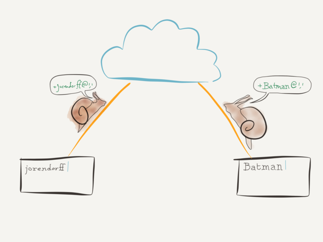

When you type "Batman", the Quill delta might say,
"insert `Batman` at line 1, column 1".
Off that goes to the server.

Meanwhile I generate a delta that says,
"insert `jorendorff` at line 1, column 1".

The server simply forwards our deltas along.
So what happens when you receive my delta?

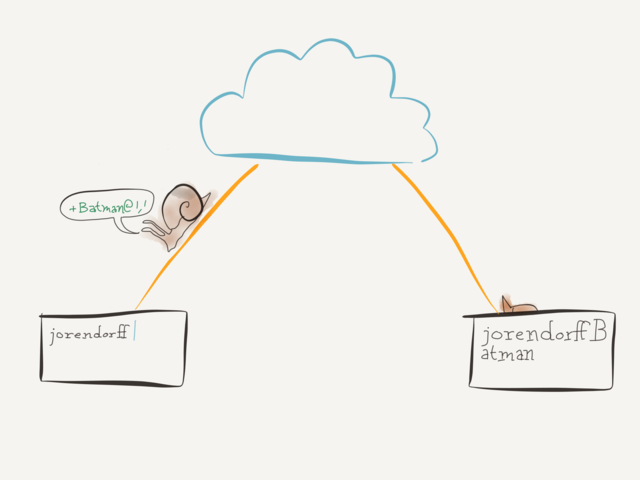

Well, Quill simply inserts `jorendorff` at the beginning of line 1.
So your document says `jorendorffBatman`.

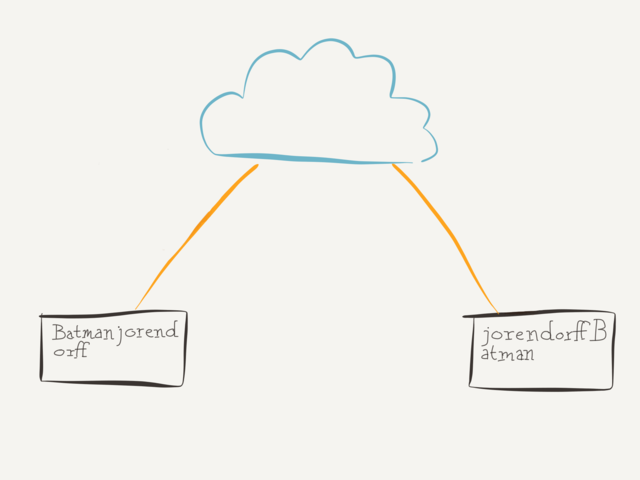

And when I receive your delta,
Quill inserts `Batman` at the beginning of line 1.
So my document says `Batmanjorendorff`.

This is an improvement over Clobberation.
All the letters are there.
Nothing got eaten.
But we're out of sync.
The problem is that if you have two deltas,
**it matters which order you apply them.**

    "Batman" + "jorendorff" /= "jorendorff" + "Batman"

I applied my patch first, then received yours.
You did the opposite.
So we got different results.

And it only gets worse from here, because we are both going to try to fix things.
Like, what happens if I put a space between `Batman` and `jorendorff`?
On my screen, it'll say, `Batman jorendorff`.
You'll receive a patch that says, "insert a space at line 1, column 7".
On your screen, it'll say, `jorend orffBatman`.


### Stab 3: UNIVAX

I was a little sick of total failure at this point,
so I decided to do something that I knew would work.
I named it [UNIVAX](https://github.com/jorendorff/univax).
Let's take it for a spin.

*(UNIVAX is [also super easy to grab and run](https://github.com/jorendorff/univax),
and for some reason it's rather delightful to use.
Maybe because this one really works.)*

OK, obviously this works great, but it's not perfect.
Let's say we want to collaborate and I'm in London.
There would be some network delay for me.
There's a limit to how fast the data can get from here to there, the speed of light.
I installed this hack so we can see how that would feel in practice.
*(I adjust the latency slider.)*
This slider introduces an artificial delay for everything
the server sends.

And this feels horrible.
It's really sluggish.

The worst thing about it is,
even with the slider set to zero,
it's still a little sluggish.

To explain why, I just have to tell you how UNIVAX works.
The full state of the editor is on the server.
The server is the one source of truth for everything.

So when I hit a key, my browser sends that keystroke to the server.
And that's all. Nothing happens locally.
If I type "jorendorff", I see nothing on my screen
until the server receives those 9 keystrokes,
inserts those letters into the document,
and broadcasts the results to everybody.
That's why this works.
That's why work doesn't get clobbered.
That's why everything stays in sync.
Because we are not editing this document separately on all our computers.
All editing happens only on the server.
There's no way edits can get out of order or anything like that,
because they all happen in one place.

The down side is, however long a network round trip takes,
that's how long it takes before I see my own keystrokes on the screen.

I'm running this app on Heroku.
Where do you think my server is?

There's actually something else here that's worse than sluggishness.
And that is, I had to write this editor myself, by hand, from scratch.
If you hit an arrow key, the *server* has to handle that arrow key.
Clobberation is 62 lines of code, including both HTML and JS, client and server.
Quilljoy is 67.
This app has 83 lines of code *just to implement arrow keys*.
The full app is already 6 or 7 times as big as the other two,
and it is *less* full-featured.

For example, did you try selecting text?
Did you try copy and paste?
They don't work, do they?
That's because I would have to implement those things, and I don't have time.
Never mind code-editing features like syntax highlighting.
And it doesn't work at all on mobile.

So actually, I kind of knew UNIVAX was a dead end when I started on it,
for this reason. It's pretty, it's fun, I actually really like it,
but it's a dead end.


## Act II: Nature of the problem

All right, to summarize our attempts so far:

1.  Clobberation: full documents exchanged, no merging. **But it clobbers work.**

2.  Quilljoy: patches exchanged, applied without detecting conflicts. **But it diverges.**

3.  Univax: individual keystrokes exchanged, full editor state on the server.  **But it's slow.**
    This approach is solid, but it hardcodes network latency right into the app.

And it's at this point that I get a little frustrated.
Why is this so hard?
All we want to do is edit a text file.
This should be easy.
Instead we keep failing.
Just one approach after another *stinks*,
and the kids are starting to ask their mother,
"Why is daddy so angry all the time?"

And so I think it's time to take a step back.
We could keep trying things,
but maybe instead we should think about why things keep going wrong for us.
So here's my question for you.

**Prompt:** What are we trying to do here? And why is it so hard?

*(discussion)*

I think the problem is that we can't avoid having
a full copy of the document
at each client.

So fundamentally we're trying to keep all these copies in sync
as changes are happening everywhere,
over a possibly slow network.
We are trying to keep everyone in sync.
That's it. That's the problem we're trying to solve here.

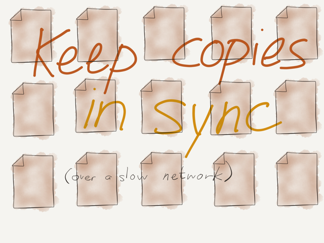

And apparently if you work on web sites long enough,
you'll have that problem at a large scale inside your site's back end.
I'm not a web developer, so I've never worked on anything that big.
But if you have users worldwide and data centers worldwide,
you'll have this issue no matter what you're doing.
So as we go on from here, keep in mind:
**I picked text editing because it's little,
and we all understand it,
and I can show lots of little examples.
But this is not about text editing.
It's about keeping data in sync.
It's a commonplace problem and it's very hard.**

In fact, it's impossible.

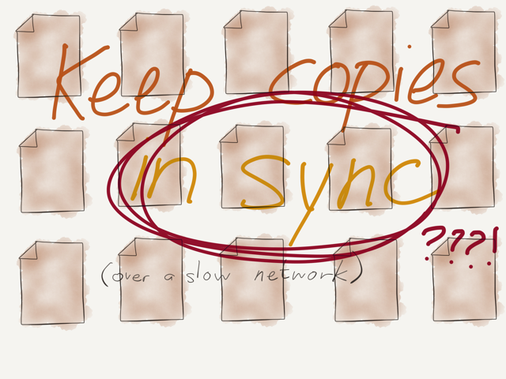

I said "keep all these copies *in sync* over a possibly slow network"
but let's be real.
"In sync" means at any given point in time, all copies are the same.
They evolve in lock step.
That's just not possible.
Remember what we said earlier about the speed of light?
It is just a fact of life
that one client will know about a keystroke first
and the server and other clients hear about it later.

And there is not enough time
for that one keystroke to propagate to everyone
before the next keystroke occurs.

So we have to weaken this requirement.
Keeping all the copies literally in sync is an easy idea to grasp,
but we need something we can achieve.

**Prompt:** How do we rephrase this requirement as something possible?

*(discussion)*

So one nice weakened form of "in sync" is called "eventual consistency".
All this means is that, all right,
we'll accept that we can't have *all* the information
in *all* the places
instantaneously,
but we try really hard to deliver all the information to all the places
*eventually*.
And the requirement, then, is simply that
once all clients get all the same information,
at that point, they'll all agree.

This is exactly what Quilljoy is missing, right?
Two editors that have received all the same deltas
can still show different text.
That is a violation of eventual consistency.
We have to do better than that.

*(slide: CRDT)*

The rest of this talk is about one way of implementing eventual consistency,
one particular approach, called CRDTs.
And at the end we'll see if I ever actually got my collaborative text editor working,
but for now we're going to set that aside
and just talk about the theory behind it.


### What is a CRDT?

What is a CRDT? Well, to begin with, a CRDT is a data type.

*(slide: C R Data Type)*

We all know what a data type is.
It's a kind of value that a computer knows how to deal with,
and all values with the same data type support the same operations,
the same methods and whatnot.

Here are some data types we all know about:

| data type    | kind of value      | operations                            |
| ------------ | ------------------ | ------------------------------------- |
| String       | Unicode text       | `+`, `.slice()`, `.replace()`, etc.   |
| Number       | number             | `+`, `-`, `*`, `Math.sqrt()`, etc.    |
| Array        | sequential data    | `arr[i]`, `.push()`, `.sort()`, etc.  |

They all have a particular kind of value that they represent,
and particular operations that they support.
CRDTs are data types in that sense.

*(slide: C Replicated Data Type)*

What makes a CRDT different is replication.
And this just means that you can have multiple copies.
In terms of actual code, it means that
we have code to send these values and operations across the network.
Like the patches in Quill, or keystrokes in UNIVAX,
an operation happens in one place,
and you can send that operation over the network and apply it to the other replicas.

And then there's one more requirement:

*(slide: Conflict-free Replicated Data Type)*

A CRDT is conflict-free.
What this means is that operations that happened in different places,
that might seem to conflict, can be reconciled automatically.
Now, the result may not be 100% desirable in every possible case.
It might say "Batmorendorff".
But at least it'll say "Batmorendorff" everywhere.
A CRDT requires this reconciliation of conflicting operations
to happen automatically, with the same results, everywhere.
If two replicas get all the same operations, but in a different order,
they have to come up with the same results anyway.

And that's all a CRDT is.
I'll show an example in a second.
But a CRDT is just a data type
whose operations can be sent over the network,
applied in random order at multiple replicas,
with rules for resolving conflicts the same way everywhere.

So does everyone agree this sounds like it would solve our problem?
Like, if we had a CRDT for text files,
that supported everything a text editor needs to do,
we'd be all set. Right?

Questions?

*(discussion)*


### CRDTs in practice

Now, a plain old string is not a CRDT.
We already know why.
Because what are the operations on a string?

*(crosstalk)*

Right.
So let's take concatenation as an example.

*(slide: += as a non-commutative operation)*

If we take some sequence of concatenations,
and apply them in random order to several different copies of a string,
what do we get?

*(audience shouts out several different answers)*

Several different answers, right?
So strings by themselves are not CRDTs.
And in fact none of the data types you're familiar with are.

*But!*
It turns out that if you add enough information about the history of edits on a string,
then it becomes a CRDT!
The history takes up a lot of space in memory, so this is expensive.
But you can make a CRDT.

And this is the general pattern.
You take the data you're *actually* interested in,
add some bookkeeping to store some history or other metadata,
and it becomes a CRDT.

The data stored in our text editor CRDT is not just the text. It's text plus history.
The history is there to help us resolve conflicts.


## Act III: RGA

The classic paper that introduced much of the vocabulary around CRDTs is
[this one, by Shapiro et al, out of INRIA](http://hal.upmc.fr/docs/00/55/55/88/PDF/techreport.pdf).
This paper is only five years old.
A lot of these ideas are quite new.

The paper contains diagrams like this one:

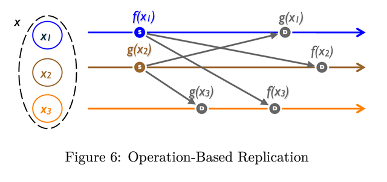

You can see three different replicas here,
and these arrows are timelines, each replica's life line.
Here a change *f* happens to x<sub>1</sub>,
here a change *g* happens to x<sub>2</sub>,
and the diagram shows those changes being forwarded
to the other replicas.

So you can see the paper is about all the same things I've been talking about,
but with more math.

This picture is super weird, weirder than it looks.
I want to emphasize that this does *not* show three replicas
discussing matters after the fact to figure out which change happened first.
Instead, we've arranged things so that *it doesn't matter* which change happened first.
Replicas can disagree about the order of events, and nonetheless agree on the outcome.

There is no one true order of events in this system.

What we're talking about here is rethinking the basic assumptions of programming
and even of how we think about time in reality.
In a distributed system, this is the shape of time.
And there's a real-world analog.


In our universe, according to relativity,
the speed of light is a hard limit on how fast information can travel through space.
So if you have two events, like E<sub>1</sub> and E<sub>2</sub> in this picture,
happening far enough away from each other,
they're like two keystrokes happening at about the same time in two different browsers.
Which one happened first *depends on your frame of reference.*
In this picture—the vertical axis here is time—it looks like
maybe E<sub>2</sub> happens slightly before E<sub>1</sub>.
This is from the perspective of an observer at E<sub>3</sub>.
But if you were traveling at a different velocity,
you'd see timespace from a different perspective.
You might see E<sub>1</sub> happening first.

Relativity says that there is no privileged frame of reference.
And it shows that there's no inherent contradiction
in different observers having different perspectives on time.


### Introducing RGA

The INRIA paper on CRDTs does not wax poetic about physics.
It's a practical paper.
It includes tons of examples of CRDTs.
Actually the *fourteenth* example in this paper
is the one I ended up using.
It's something called a *replicated growable array*, or RGA.

Their implementation is 38 lines of pseudocode.
It took me about 200 lines of JS.

The basic idea is that there are only two operations on arrays.
Insert and delete.
The same goes for strings.
Whatever you do to a text document, you're either inserting or deleting characters.
A big search-and-replace is a series of inserts and deletes.
If we can handle all possible conflicts between inserts and deletes, we're done.

It helps a bit if we think of our string of text as an actual string,
like a string of beads.

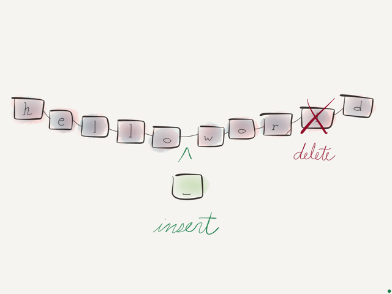

That's the actual data we care about;
now we just have to figure out what extra metadata or history we need to resolve conflicts.

Suppose you were creating a string type
with `.insert()` and `.delete()` methods.
What arguments would those methods take?

*(discussion)*

OK. Both methods will take arguments that specify locations in the document.
And this is a problem, because of what we saw with Quill.
If you use, say, line and column numbers to specify locations,
other people's edits will cause things to move around, and you'll get divergence.
We need a way of saying "where to insert" and "what to delete" that is robust.
RGA gets this by assigning each character a unique id.

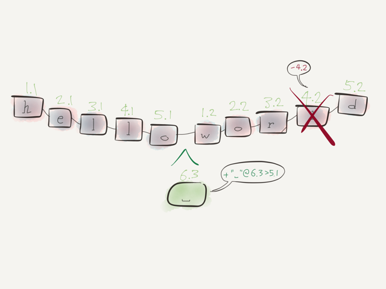

But wait, how do our many users generate unique ids?
This is not so hard.
First we have to assign each replica (each user) a unique id.
I have the server do that when you connect.
Then the characters get two-part ids, as shown.
The first number just counts up: 1, 2, 3, 4, 5.
The second number is the replica where the character was first inserted.
You can see the characters in "hello" were typed on replica 1,
and the characters in "world" were typed on replica 2.

There's a little more to it,
but this is the general scheme whereby an RGA avoids conflicts.

In my toy implementation of RGA in JavaScript,
each character and its unique id are stored in an object.
There's an object per character, forming a linked list.
It's pretty wasteful, and it wouldn't be hard to optimize it to save a bunch of memory.
Pull requests are welcome!


### Peeredit demo

So let's try it out.
This is it. Big finish.

It's called Peeredit.

*([Peeredit is easy to grab and run!](https://github.com/jorendorff/peeredit))*

You'll notice this one is using the Ace editor.
It supports copy and paste, automatic indentation,
all the mouse and keyboard niceties you're used to.
I've configured it for editing JavaScript,
so you'll get syntax highlighting and automatic indentation.
Pretty nice!


## A warning about reading the code

Of course this is the part where I say,
if you want to dig deeper,
[you should go check out the source code,](https://github.com/jorendorff/peeredit/)
but some of you might actually do that, so I have to warn you.

Distributed algorithms are surprisingly hard to understand by reading source code.

There's a reason for this.
Imagine you've got the source code for ants.
You're reading it to try to understand how ants navigate,
and you find some code that makes the ant follow a pheromone trail.
You might think, *what?!*
What good is that?
Did ants evolve in an environment where the path to everything they need
is marked by convenient pheromone trails?
Well, of course not.
The code only makes sense when you realize ants live in colonies with thousands of other ants,
all constantly exploring and leaving trails for others to follow,
and you start thinking about those interactions.
Mentally stepping through the ant source code
isn't a good way to learn about ants.

It would be exactly the same if you tried to learn about IP routing
by reading the source code of a router.
Or if you tried to learn about a particular CRDT
by reading an implementation.

So instead I will try to tell you.

This is also the part where we see why you shouldn't do what I did.


### Conflicts

(or, what it would be like to invent a CRDT)

*(I can't get into this when I give this talk live, but
since you read this far, you get the bonus material.
I think a lot of the understanding is here.)*

What kinds of conflicts crop up when we have edits happening at multiple places at once?

We need to look at *combinations of edits* that couldn't happen in a single editor,
and figure out how we want to handle them.

*   **Delete-delete:** Two editors delete the same text at the same time.

    Of course, in this case, it's easy to say what should happen:
    the text should be quite thoroughly deleted!
    But it's a case to test for, at least.
    We wouldn't want to crash when this happens,
    or inadvertently wipe out an innocent nearby character as well.

*   **Insert-delete:** One editor inserts text after a particular character,
    and at the same time somebody else is deleting that character.

    Again, it's easy enough to say what we think should happen,
    but we have to figure out how to implement that.

*   **Insert-insert:** Multiple users type at the same time,
    unaware of each other,
    so we get two "insert" events with the same requested position.

    One says: "insert `'j'` with id 8.1 after character 7.3".  
    One says: "insert `'B'` with id 9.2 after character 7.3".

    This one is a little tricky, since there is no obvious right answer,
    and yet we *must* get the *same* answer everywhere.
    You may already have guessed the solution:
    we use the new characters' ids as a sort of tie-breaker.
    But did you think about how we detect that we've got a conflict to begin with?
    Did you consider that we can also get a similar pair of events *in a single editor,*
    with no conflicts?

You can see how creating a CRDT is hard work!
You need a *single* set of rules for applying changes
that handles all the possible conflicts.
For that matter, you have to convince yourself
that you've *thought* of all possible conflicts!
Computer scientists are trained to do this kind of work.
Most software engineers, people like you and me, are not.

In my case, I had the paper to work from,
so I took the algorithm on faith and used
[generative testing](https://github.com/jorendorff/peeredit/commit/d61a197273a13b98a3037ed995ba11454732c371)
to find
[all](https://github.com/jorendorff/peeredit/commit/4280a6f828d70f2ce0c3020934d0a00c69e2958d)
[my](https://github.com/jorendorff/peeredit/commit/68063554dde7ce2371e79f20c418a1971547ab82)
[bugs](https://github.com/jorendorff/peeredit/commit/cf48620fef8dd8708c9312f919c3fb0a330421e1).
Most people implementing CRDTs from scratch for production systems don't have that option.
They end up having to innovate a little—implementing things that you can't just look up in a paper.
They have to do computer science.

If all of that sounds daunting, well, I agree.
The point of this talk isn't that you should rush out and implement your own CRDT from scratch.
I mean, sure, you should, because it's fun and enlightening;
but for your day job, you probably want to grab one
that someone else has already built and tested.

This is why CRDTs are not exactly spreading like wildfire.
"As simple as relativity" is not a huge selling point.
There's a popular alternative to eventual consistency,
called *not caring if you ever get the right answer or not*,
that's a lot easier to implement.

But all kinds of back-end systems are starting to incorporate CRDTs.
[Riak supports several general-purpose CRDTs.](http://docs.basho.com/riak/kv/2.1.4/learn/concepts/crdts/)
If you have a counter, a map, or a set,
and lots of users mutating it in real time,
you can get a CRDT for that off the shelf.
They're quite easy to use.
Cassandra has some too.
The Phoenix Framework uses a CRDT and a gossip protocol behind the scenes
to keep presence information in sync across nodes.
There are JavaScript libraries that implement CRDTs.
And so on.

So congratulations!
Now you've got a fighting chance at recognizing this problem if you ever have it,
and you know where to look for answers.


### Bonus: now you have two problems

The first time I gave this talk,
I was frantically hacking on the code at the last minute,
and I actually didn't get Peeredit working in time.
The CRDT was finished, but hooking it up to a text editor, I kept having problems.

What I didn't realize is that
even once you get a working replica of the data into everyone's browser,
this RGA object,
you still have another copy of the document: the editor itself.

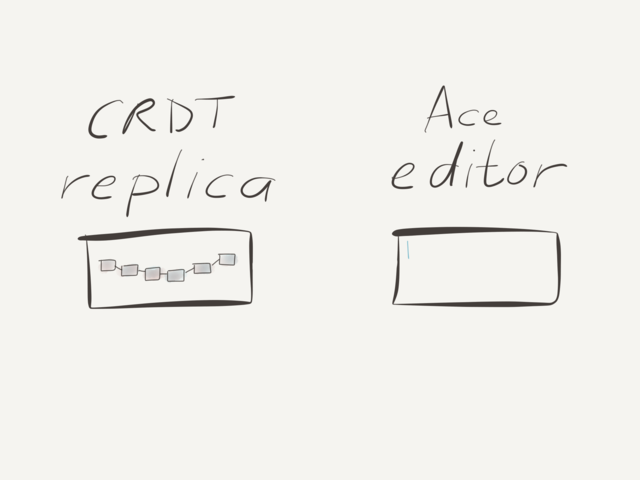

The editor is another replica!
Worse, it's an uncooperative replica.
It's not a CRDT; it wasn't designed with that in mind.
If you communicate with it asynchronously, via the event loop,
then you've got all the same problems again *inside the browser*.

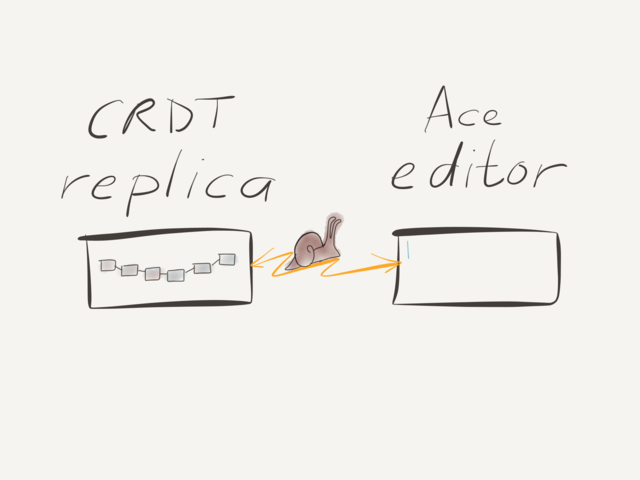

This I solved using brute force.
If you want the awful details, you can peek at the source.
I think I've gone on long enough for now.


## Conclusion

This is what computer science is about, to me.
It's about seeing the real nature of the problem.
It's about using the techniques of logic and proof to recognize impossible problems
and find creative solutions.

500 lines is not a lot of code.
But to me, when I finally got it working, it was the end of an epic journey.
I really had to change the way I saw things before I could get there.
